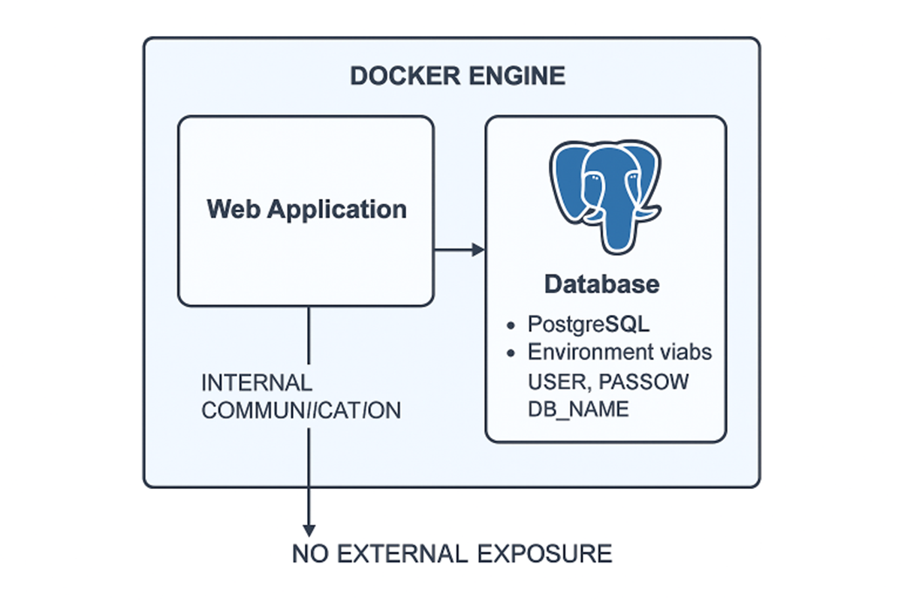
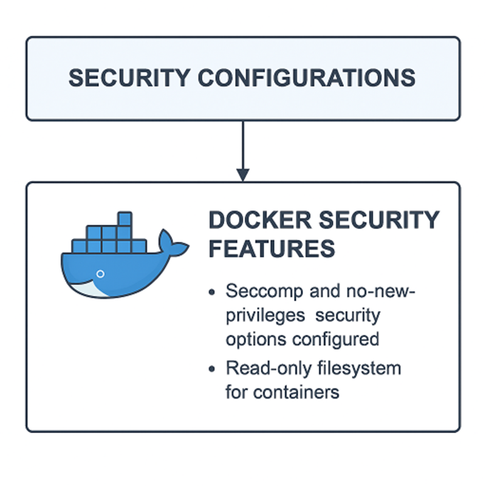
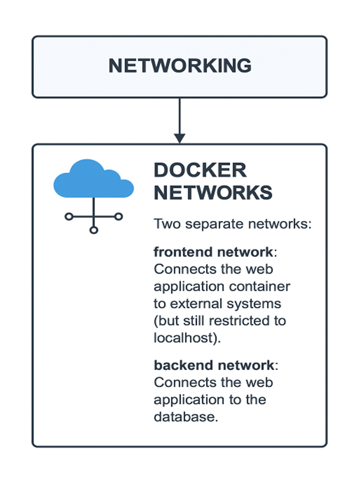
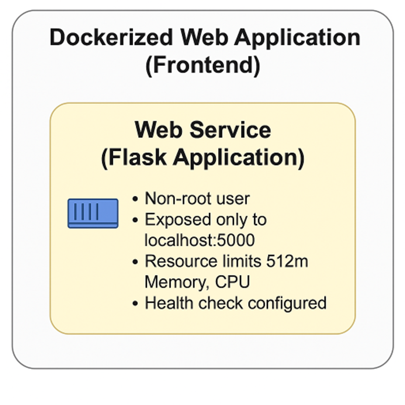

ARCHITECTURE DIAGRAM
1.	Database (Backend): The backend PostgreSQL database also running in its container. Environment variables for authentication (user, password, database name). Internal-only communication with the web application (no external exposure). Database (PostgreSQL) Containerized (using Docker) PostgreSQL database. Exposed internally within the Docker network (no external exposure). Credentials (user, password, db name) stored in environment variables.

 

Security Configurations: Docker configurations hardening, including no-new-privileges, logging configuration, and other flags. The app is configured to run on secure internal networks. Docker Security Features Seccomp and no-new-privileges security options configured. Read-only filesystem for containers.

 

3.	Networking: Containers are isolated within Docker's internal network. There is a separation between the frontend and backend network. The web container and the database container are connected via the Docker bridge network.
Docker Networks
Two separate networks: frontend network: Connects the web application container to external systems (but still restricted to localhost).backend network: Connects the web application to the database.

 
4.  Dockerized Web Application (Frontend) include: The hardened Flask application running inside a container. The container will be running as a non-root user. Will have a health check for container monitoring. Enforced resource limits (CPU, Memory). Exposed only to localhost to restrict access. Architecture Diagram Breakdown: Web Service (Flask Application) Containerized (using Docker) and running the Flask app. Configured to run as a non-root user. Exposed only to localhost on port 5000. Configured with memory and CPU limits (e.g., 512m for memory). Health check configured for uptime monitoring. Resource limits enforced (memory, CPU).

 
                          
