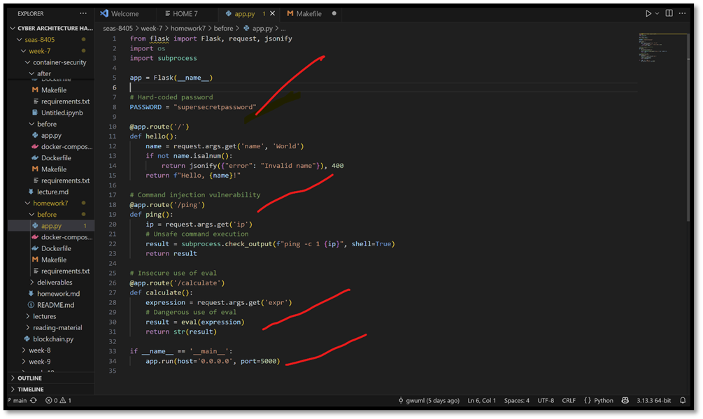
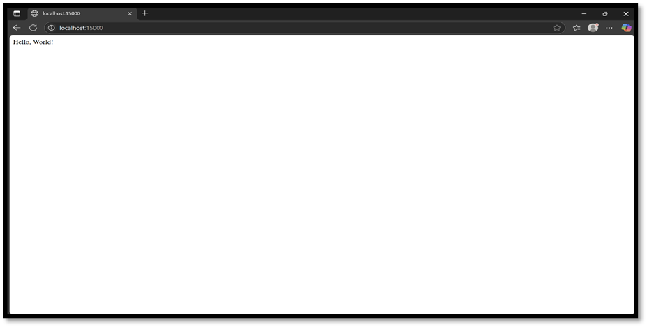
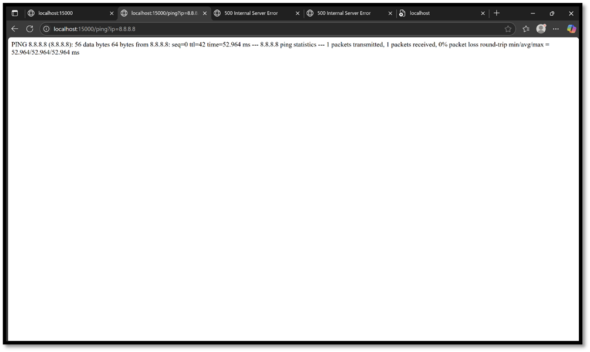
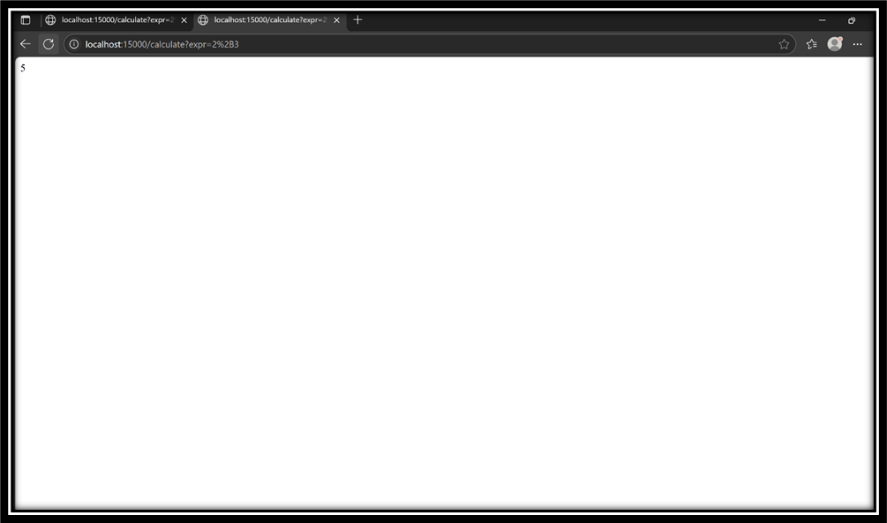
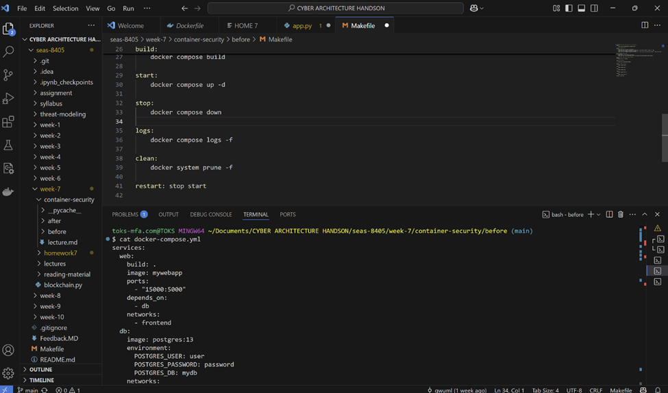
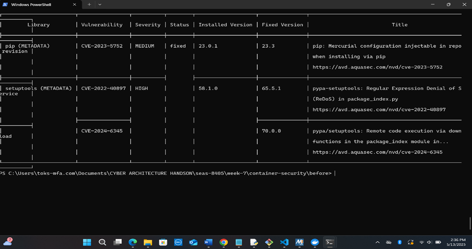

Securing Containerized Micro services
INTRODUCTION
In this assignment, you will assume the role of a cybersecurity architect tasked with securing a vulnerable containerized application and transform it into a secure deployment. The process involved environment setup, code remediation, threat modeling, security architecture design, and verification. This assignment is a containerized Python Flask web application with security hardening applied at the application and Docker levels. It includes secure code practices, hardened Dockerfile, a `docker-compose.yml` setup, and automated tests to verify protection against common vulnerabilities.

METHODOLOGY
PART 1
To begin, Git was installed and activated through visual code. Subsequently the scafolding code and instructions in GitHub repository. https://github.com/gwuml/seas-8405/tree/main/week-7/homework7 was cloned into my visual code named cyber architecture handson for easier access, review and deployment
Part 1: Environment Setup
To understand the Application, the Flask app was reviewed in the before/ directory and launched. The endpoints were also tested and the confirmation of the vulnerabilities are attached.
 
 

Test the endpoints: /, 
 

/ping?ip=8.8.8.8,

 

 
calculate?expr=2+3 test

Vulnerability Scanning and Static Analysis:
a.	Trivy and Docker Scout was used to scan the image for known vulnerabilities.
b.	Applied Bandit and pip-audit to identify code and dependency issues.
c.	Docker Bench was used for Security to review host security configurations. An Initial Scanning was also executed and the a number of vulnerabilities and misconfigurations were seen and documented and attached below:
 

 

 

 

Summary of Findings:
The findings reveal a significant vulnerability in the base operating system, specifically Alpine version 3.21.3. A  high-severity issue was identified in the `sqlite-libs`, categorized under CVE-2025-29087. The problem pertains to an integer overflow found in the `concat_ws` function. To resolve this vulnerability, it is advised to upgrade `sqlite-libs` to version 3.48.0-r1.
In addition to the OS vulnerability, three vulnerabilities were discovered in Python packages. The package `pip` has a medium severity vulnerability listed as CVE-2023-5752, which requires an upgrade to pip version 23.3. Furthermore, the `setuptools` package has two high-severity vulnerabilities: one related to ReDoS (CVE-2022-40897) and another associated with remote code execution (CVE-2024-6345). To mitigate these risks, it is recommended to upgrade `setuptools` to version 70.0.0.

Part 2: Securing the App and Container
Steps Taken
To secure and harden the application app.py, a comprehensive remediation approach, was adopted:
1. Code Review and Code Remediation: 
Serial	Vulnerability	Severity	Fix Applied
1.	Hardcoded Password	Critical	Replaced with environment variable in .env
2.	eval() injection	High	Replaced with simple_eval
3.	Input not validated	Medium	Added validation for query params
4.	Runs as root in Docker	High	Configured non-root user in Dockerfile
5.	Image vulnerabilities (sqlite-libs, pip, setuptools)	Medium–High	Updated to fixed versions
6.	Open port exposure	Medium	Bound to localhost (127.0.0.1) only Restricted Flask to listen on 127.0.0.1.
7.	Lack of resource limits	Medium	Enforced with Compose memory and PID limits

1.	Environment Configuration:
	Introduced a .env file for secure storage of secrets and credentials.
	Updated code and docker-compose.yml to load sensitive values from the .env file.
2.	Docker Hardening:
	Switched to  slim from Alpine AS builder.
	Ensured the application runs as a non-root appuser.
	Added a HEALTHCHECK directive to the Dockerfile.
	Implemented multi-stage builds for cleaner and smaller images.
3.	      Docker Compose.yml  Security improvements:
a.	Added read-only: true, memory limits, PID limits, and security_opt flags.
b.	Restricted port binding to 127.0.0.1 to prevent unwanted exposure.
4.	       Automation:
a.	Created a docker_security_fixes.py script to apply hardening flags automatically.

Summary of Architecture and Security Improvements:
The summary of updated architecture includes:
The updated architecture incorporates a hardened Docker environment designed for enhanced security and performance. This environment is built with a minimal base image, ensures non-root execution, and includes health checks to monitor the status of applications running within containers.

To enhance the organization and security of the system, there is a clear separation of concerns through the use of distinct frontend and backend networks. This approach not only streamlines communication but also fortifies protection against potential vulnerabilities between components.

Additionally, all sensitive information is stored securely in environment variables, which are loaded through .env files. This method helps safeguard secrets while maintaining ease of access for applications during runtime. Furthermore, security measures are reinforced by integrating tools like Trivy, Bandit, and Docker Bench into the workflow, facilitating continuous security assessment and ensuring that best practices are upheld.

Lastly, resource control and filesystem restrictions are implemented using Docker Compose, limiting access and resource usage through settings such as read-only permissions, memory limits, and process ID limits. These measures contribute to a more secure and efficient deployment of applications within the Docker ecosystem. These changes reduce the attack surface, enforce least privilege, and allow for better monitoring and containment.
TESTING AND RESCANS
Steps to Run Security Test Suite
	chmod +x test_hardened_app.sh
	./test_hardened_app.sh
	This will verify:
	Endpoint security
	Command injection prevention
	Eval protection
	Container read-only filesystem
	Healthcheck status
The testing of hardened containers and scripts yielded positive results, confirming the overall security and functionality of the application. The primary endpoint responded successfully, indicating that the application is reachable. Furthermore, the tests conducted on input validation demonstrated that it effectively handles both safe and unsafe inputs.
Specifically, the application successfully processed a safe input, validating its ability to perform calculations correctly. In contrast, attempts to inject unsafe inputs were likely blocked, affirming that the application is secure against code injection vulnerabilities. Additionally, the filesystem was confirmed to be read-only and Docker hardened, contributing to the overall security framework. Overall, the health check revealed that the container is performing well and maintaining a healthy state, reinforcing confidence in its reliability and security posture. Secrets managed via .env file (not committed)
 
	Command injection prevention

 
Endpoint security

 

PART 4
Documentation and Architecture Design: A Developed a threat model markdown document and architectural diagram was also developed.
 Reflection and Lessons Learned
This assignment reinforced the importance of cyber secured architectures which include but are not limited to the following:
•	Secure coding practices: How simple mistakes like using eval() or hardcoding credentials can create major risks.
•	Container security: A hardened Docker image and Compose file greatly mitigate container escape and runtime attacks.
•	Automated scanning tools: Tools like Trivy, Bandit, and pip-audit are essential for detecting both OS and Python-level vulnerabilities.
•	Threat modeling: Using STRIDE, NIST and MITRE ATT&CK provided a structured approach to identify and address risks systematically.
•	Automation: Writing scripts to enforce security standards reduces manual errors and enhances reproducibility.
To conclude, it is important for organizations and cybersecurity architects to enforce and insist that security must be built into every stage from code to container to deployment and not an afterthought as is often practiced.

